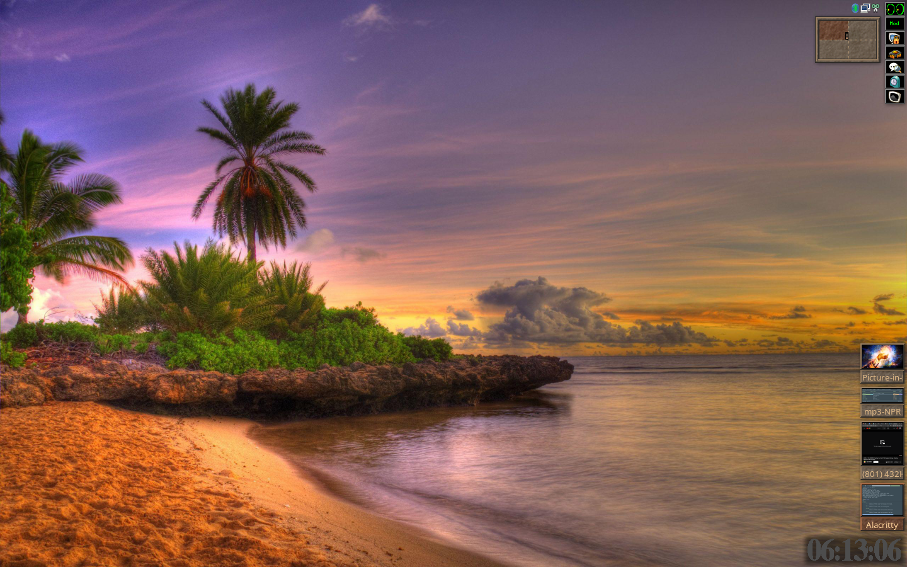
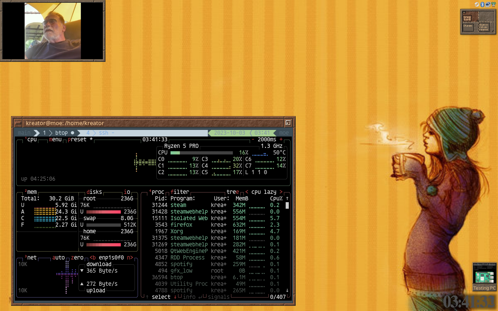

# My current FVWM3 config scripts and images
### Yes, this is FVWM3 not 2 :P

[Notes](./dev/Notes.md) on compiling on Fedora, and maybe some other notes too.

Adding a toolbar, mostly for toggles, one menu and a terminal.

Coffee in the morning is goood!

Have a great day!! \o/

